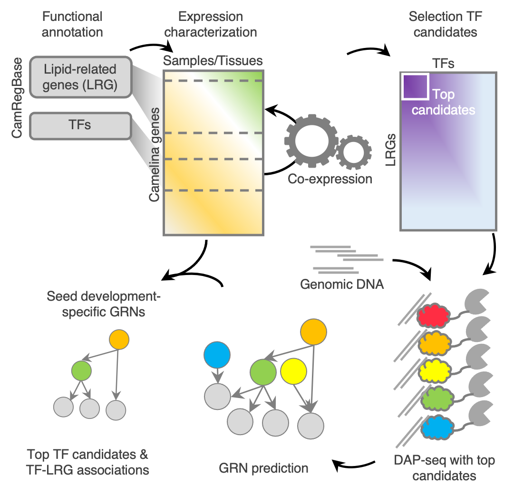

# TransRegLipMet_CamelinaSeed

This repository contains a description of primary data, processed data, and codes used to obtain the main results/figures of this project. 

**Graphical abstract**

 

## Main sections

### Raw data pre-processing

* Analysis of Seed expression data: RNA-seq 
* Co-expression (MI) calcualations
* Identification of DNA-binding site (peaks)based on DAP-seq

### Expression analysis of genes involved in lipid accumulation during Camelina seed development

### Identification of candidate lipid transcriptional regulators by co-expression analysis

### Establishing the DNA-binding landscape of the candidate transcription factors

### Predicting gene targets for the selected TFs

### Identified TFs associate with distinct aspects of lipid metabolism

### Dynamic behavior of the predicted networks during seed development

